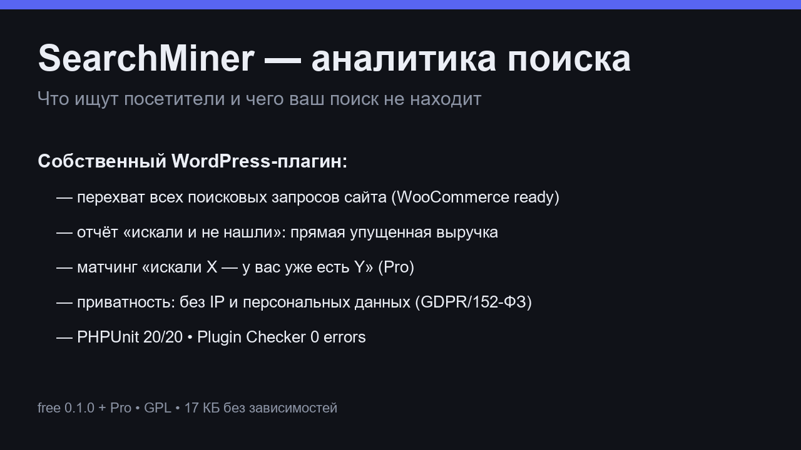

# SearchMiner

**[RU]** Плагин WordPress, который показывает, **что посетители ищут на вашем сайте** — и чего они не находят. Лёгкий «наблюдатель» поисковых запросов: не заменяет поиск, а рассказывает, чего ему не хватает.

**[EN]** A WordPress plugin that shows you **what visitors search for on your site** — and what they can't find. A lightweight search-analytics observer: it doesn't replace your search, it tells you what it's missing.

---

## Зачем / Why

- **RU:** Нулевые результаты поиска — это упущенные продажи. SearchMiner записывает каждый поисковый запрос (включая опечатки и запросы «в ноль»), показывает топ-запросы, динамику и товары, которые посетители искали, но не нашли.
- **EN:** Zero-result searches are lost sales. SearchMiner records every search query (typos included), shows top queries, trends, and products visitors wanted but couldn't find.

## Возможности бесплатной версии / Free features

- Захват всех поисковых запросов + счётчики кликов и «поисков без клика»
- Определение «нулевых» запросов (ничего не найдено)
- Дашборд: топ запросов, динамика по дням, виджет на главной админки
- Приватность: **не сохраняет IP**, персональные данные не записываются (GDPR / 152-ФЗ friendly)
- Без внешних сервисов: все данные — в вашей базе
- Полное удаление: при удалении плагина таблицы и опции стираются

## Pro-версия / Pro

| | Free | Pro |
|---|---|---|
| Аналитика запросов, нулевые запросы | ✅ | ✅ |
| **Выручка под риском**: нулевой запрос → товар из каталога | — | ✅ |
| **Недельные дайджесты** на email | — | ✅ |
| **Кластеризация опечаток** (многобайтовый Левенштейн, кириллица) | — | ✅ |
| Цена | бесплатно | 2 990 ₽ / $29 в год |

→ **Купить Pro / Buy Pro:** [лендинг / landing page](https://yodzira.github.io/searchminer/)

## Установка / Install

1. Скачайте `searchminer.zip` со страницы [Releases](https://github.com/Yodzira/searchminer/releases/latest)
2. WP-админка → **Плагины → Добавить новый → Загрузить плагин** → выберите zip → Активируйте
3. Готово: раздел **SearchMiner** появится в меню (данные начнут собираться с первых поисков)

EN: download the zip from Releases → WP admin → Plugins → Add New → Upload Plugin → Activate.

## Требования / Requirements

- WordPress 6.0+ (протестировано до 7.1), PHP 7.4+
- Работает с WooCommerce (учитывает продуктовые поиски) и плагинами кэширования

## Качество / Quality

- PHPUnit: 20 тестов, 47 assertions ✅
- Официальный Plugin Checker: 0 errors ✅
- Матрица конфликтов: WooCommerce, Autoptimize, LiteSpeed Cache ✅
- SQL: все запросы через `$wpdb->prepare`; uninstall полностью чистит данные

## Лицензия / License

GPL-2.0-or-later (совместимо с WordPress).

💰 **[Купить Pro / Buy Pro — 2 990 ₽/год](https://yodsira.com/buy/searchminer)** — лицензия на 1 сайт, 12 месяцев обновлений.
